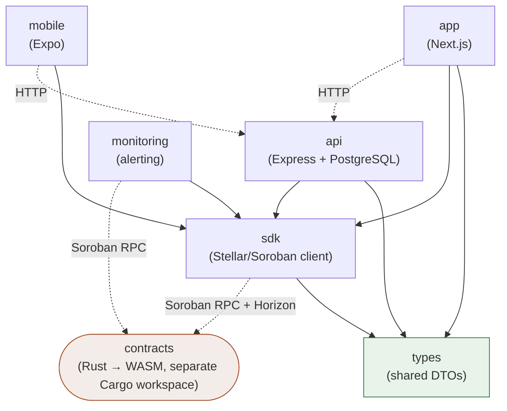

# ADR 0001: Monorepo Package Boundaries

- **Status**: Accepted
- **Date**: 2026-07-24

## Context

`packages/*` currently holds seven packages — `api`, `app`, `contracts`, `mobile`,
`monitoring`, `sdk`, `types` — managed as a single pnpm workspace (`pnpm-workspace.yaml`)
plus an independent Cargo workspace for `contracts`. The rationale for splitting along
these lines, and what's allowed to depend on what, has never been written down. That
makes two things slower than they should be:

- **Onboarding**: a new contributor has to reverse-engineer from `package.json` files
  and `import` statements which packages are meant to talk to each other and how.
- **Dependency decisions**: "should this new helper live in `sdk` or just in `api`?",
  "can `mobile` import from `app`?" — these get decided ad hoc per-PR without a
  reference to check against.

This ADR documents the intended boundaries and the rules for crossing them. It also
records, honestly, where the current codebase already deviates from those rules, so the
gap is visible instead of assumed away.

## Decision

### Package boundaries

| Package | Language | Role |
|---|---|---|
| `types` | TypeScript | Shared DTOs and API response types. No behavior, no I/O. The one package everything else may depend on freely. |
| `sdk` | TypeScript | Single source of truth for talking to Stellar — Horizon REST calls and Soroban contract invocations. Exists so contract-calling logic (URLs, request shapes, error handling) isn't reimplemented per consumer. |
| `contracts` | Rust (Soroban/WASM) | The on-chain protocol itself: `registry`, `market`, `dispute`, `fee_distribution`, `insurance_pool`. Not part of the TypeScript dependency graph — see [Contracts is a boundary, not a dependency](#contracts-is-a-boundary-not-a-dependency) below. |
| `api` | TypeScript (Express) | The backend of record: auth, business logic, PostgreSQL persistence via Prisma. The only package with direct database access. |
| `app` | TypeScript (Next.js) | Web frontend. Talks to `api` over HTTP and to the user's wallet (Freighter) directly for signing. |
| `mobile` | TypeScript (Expo/React Native) | Mobile frontend. Same relationship to `api` as `app` — a second, independent HTTP client, not a dependent of `app`. |
| `monitoring` | TypeScript (Node) | Standalone observer: watches contract events, tracks balances, fires alerts. Reads from Stellar; writes to nothing else in this repo. |

The split follows **runtime boundaries, not code-reuse convenience**: `api`/`app`/
`mobile`/`monitoring` are four independently deployed processes, so none of them may
import from another's `src/` — only `types` and `sdk` are meant to be shared library
code. `contracts` is its own boundary because it ships as WASM to a different runtime
(the Stellar network) entirely, not as a Node/npm artifact.

### Allowed cross-package import rules

```
types    ← anything (leaf; zero workspace dependencies of its own)
sdk      ← api, app, mobile, monitoring          (sdk itself may depend only on types)
api      ← nothing                                (api is never imported by another package)
app      ← nothing
mobile   ← nothing
monitoring ← nothing
```

Concretely:

1. **`types` has zero workspace dependencies.** It's TypeScript interfaces/DTOs only —
   no imports of `sdk`, no runtime logic. Anything may depend on it.
2. **`sdk` may depend only on `types`.** It must not import from `api`, `app`, `mobile`,
   `contracts`, or `monitoring` — it's consumed by all of them and can't take on a
   dependency in the other direction without creating a cycle.
3. **`api`, `app`, `mobile`, `monitoring` may depend on `types` and `sdk`, and on
   nothing else in `packages/*`.** In particular:
   - `app` and `mobile` **must not** import from each other or from `api`'s `src/` —
     they are separate deployables that talk to `api` exclusively over HTTP.
   - `api` **must not** import from `app` or `mobile`.
   - No package should reach into another package's `src/` via a relative path
     (`../../other-package/src/...`) to work around this — if something needs to be
     shared, it belongs in `types` or `sdk`, not a deep import.
4. **No package imports Rust source from `contracts`,** and `contracts` imports nothing
   from the TypeScript workspace — see below.
5. **No circular workspace dependencies.** `sdk`'s `types`-only rule (point 2) is what
   keeps the graph a DAG; don't introduce an edge that violates it even transitively.

#### Contracts is a boundary, not a dependency

`contracts` is a separate Cargo workspace, not a pnpm package — it isn't in
`pnpm-workspace.yaml` and nothing in `packages/*` has a `file:`/`workspace:` dependency
on it. The only interfaces are:

- **Build-time**: `contracts` compiles to WASM (`make build` in `packages/contracts`)
  and is deployed independently via the Stellar CLI (see
  [packages/contracts/README.md](../../packages/contracts/README.md)).
- **Run-time**: consumers hold a deployed **contract ID** (an env var —
  `REGISTRY_CONTRACT_ID`, `MARKET_CONTRACT_ID`, etc.) and invoke it over Soroban RPC,
  ideally through `sdk`.

This means `contracts` has no compile-time relationship to the rest of the repo at all.
Its public interface is documented separately in [docs/CONTRACTS.md](../CONTRACTS.md);
upgrade and migration mechanics are covered in
[packages/contracts/UPGRADE_GUIDE.md](../../packages/contracts/UPGRADE_GUIDE.md), not by
this ADR.

### Package dependency graph



Solid arrows are compile-time (`workspace:*`) dependencies. Dashed arrows are runtime
calls (HTTP or Soroban RPC) — not a package dependency in the pnpm/Cargo sense, and not
something `import`-boundary rules apply to.

### Current deviations from this decision

Written down so the gap is a known, trackable thing rather than a surprise the next time
someone reads the source:

- **`api` does not currently import `sdk`.** `api`'s wallet/Horizon code
  (`packages/api/src/controllers/wallet.ts`) reimplements the same Horizon REST calls
  `sdk`'s `HorizonClient` already provides, rather than depending on `sdk`. Per this
  ADR, that duplication should be resolved by having `api` depend on `sdk`.
- **`app` and `mobile` call `@stellar/stellar-sdk` directly** rather than going through
  `sdk`. `sdk` was written to be their shared client (see its own description: "Single
  source of truth for Stellar / contract interaction — consumed by API and App") but
  isn't wired up yet in either.
- **`api` declares a `workspace:*` dependency on `types`** (`devDependencies` in
  `packages/api/package.json`) **but nothing in `packages/api/src` currently imports
  it.** Not a rule violation, just currently unused.

None of these are blocking — they're pre-existing state, not something this ADR
introduces or requires fixing immediately. They're recorded here so a future PR that
wires `api`/`app`/`mobile` up to `sdk` is understood as *closing a known gap*, not as a
new architectural direction.

## Consequences

**Positive:**
- A new contributor can answer "where does this code belong?" by checking this table
  instead of asking in chat or guessing from precedent.
- `api`, `app`, and `mobile` staying import-independent of each other means any one of
  them can be redeployed, rewritten, or replaced without a source-level ripple effect
  into the others — the only contract between them is `api`'s HTTP surface (see
  `packages/api/README.md` for its docs, and `packages/api/openapi.json` for the
  generated spec).
- Centralizing Stellar interaction in `sdk` (once `api`/`app`/`mobile` actually depend on
  it — see deviations above) means a Horizon/Soroban RPC shape change or a bug fix in
  retry/error handling is a one-package change, not three.

**Trade-offs:**
- `sdk` being `types`-only forces any Stellar-interaction helper that needs
  request-specific business logic to either live in the calling package or accept a
  more generic shape in `sdk` — occasional friction, but it's what keeps the graph
  acyclic.
- `contracts` being fully outside the TypeScript graph means there's no compiler-enforced
  link between a contract's function signature and the code that calls it — that safety
  net is `packages/contracts/UPGRADE_GUIDE.md` plus integration tests, not the type
  system.

## References

- [docs/CONTRACTS.md](../CONTRACTS.md) — contract interface reference
- [packages/contracts/README.md](../../packages/contracts/README.md) — contracts package overview, build/deploy/upgrade
- [packages/contracts/UPGRADE_GUIDE.md](../../packages/contracts/UPGRADE_GUIDE.md) — contract upgrade runbook
- [packages/sdk/package.json](../../packages/sdk/package.json) — SDK package description and exports
- [packages/api/README.md](../../packages/api/README.md) — API docs and endpoint reference
