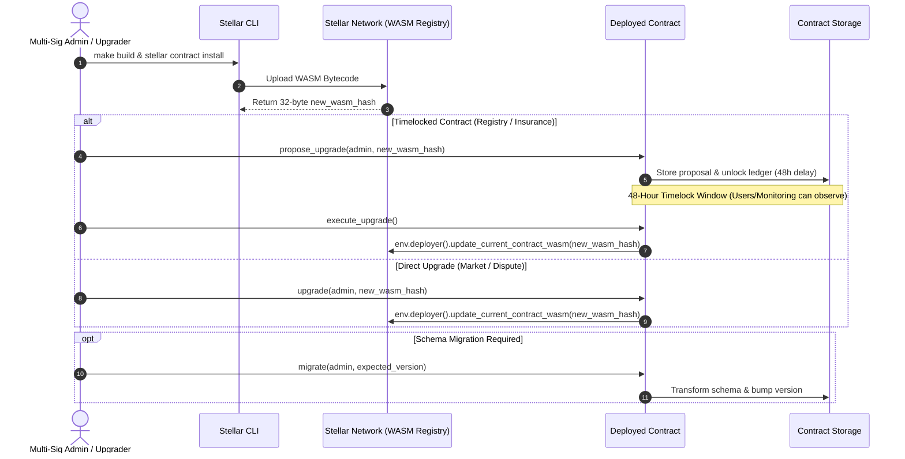

# ADR 0002: Soroban Smart Contract Upgrade Strategy

- **Status**: Accepted
- **Date**: 2026-08-25

## Context

The BlueCollar protocol relies on five core smart contracts deployed on the Stellar Soroban network:
- `registry` — Worker profiles, curation, staking, badges, and reputation
- `market` — Tips, escrow payments, and arbitration
- `dispute` — Dispute lifecycle, evidence submission, and settlements
- `fee_distribution` — Protocol fee collection and distribution
- `insurance_pool` — Worker insurance pool contributions and claim payouts

As the protocol evolves (bug fixes, optimizations, new features, and storage schema adjustments), contracts must be upgradeable. However, contract upgrades in decentralized systems introduce serious security and operational challenges:

1. **Address Permanence**: Changing contract IDs breaks frontend clients (`packages/app`), mobile apps (`packages/mobile`), backend services (`packages/api`), indexers, and external integrations that hold pinned contract addresses.
2. **State Preservation**: Worker registrations, escrow balances, staking deposits, and dispute histories stored in Soroban ledger storage must remain intact during and after an upgrade.
3. **Decentralization & Security**: Instantaneous, unannounced contract upgrades by an admin key represent a centralization risk and vulnerability to compromised admin credentials.
4. **Storage Layout Compatibility**: Schema migrations between WASM versions must prevent storage corruption and data deserialization panics.

This ADR documents the chosen upgrade and migration strategy for all Soroban smart contracts in the BlueCollar monorepo.

---

## Decision

### 1. Native In-Place WASM Replacement
We adopt Soroban's native in-place upgrade mechanism:
```rust
env.deployer().update_current_contract_wasm(new_wasm_hash);
```
- **Process**: New WASM bytecode is installed on the Stellar network (`stellar contract install`), producing a deterministic 32-byte bytecode hash. The deployed contract is then updated to point to the new hash.
- **State & ID Preservation**: The contract address (Contract ID) and all storage entries (instance, persistent, and temporary) remain untouched and continuous.

### 2. Dual Authorization & Governance Model

To balance agility with protocol security, we apply tiered upgrade governance based on contract criticality:

#### A. Two-Step Timelocked Upgrades (Critical Contracts: `registry`, `insurance_pool`)
For contracts securing identity, staking, or pooled funds:
1. **Proposal (`propose_upgrade`)**: Restricted to accounts with `ROLE_UPGRADER` or multi-sig admin authority. Stores `proposed_wasm_hash` and `upgrade_valid_after = current_ledger + TIMELOCK_LEDGERS`.
2. **Timelock Delay**: A mandatory **48-hour timelock** (`TIMELOCK_LEDGERS = 34,560` ledgers at ~5s per ledger).
3. **Execution (`execute_upgrade`)**: Callable by any address once `current_ledger >= upgrade_valid_after`.
4. **Cancellation (`cancel_upgrade`)**: Admin can cancel a proposed upgrade before execution if an issue is discovered.

#### B. Admin-Gated Direct Upgrades (Operational Contracts: `market`, `dispute`, `fee_distribution`)
For high-frequency operational contracts:
- Upgrades are executed via `upgrade(new_wasm_hash)` with strict cryptographic authorization (`admin.require_auth()`).
- Managed by a multi-sig administrative account.

### 3. Explicit Storage Schema Migration
When a new WASM version alters storage struct definitions or key layouts:
1. **Version Tracking**: Contracts maintain a monotonically increasing version number in persistent storage.
2. **Migration Functions (`migrate`)**: A dedicated administrative migration function is invoked immediately following WASM upgrade:
   ```bash
   stellar contract invoke \
     --id <CONTRACT_ID> \
     --source <ADMIN_SECRET> \
     -- migrate \
     --admin <ADMIN_ADDRESS> \
     --expected_version <CURRENT_VERSION>
   ```
3. **Rollback Guard**: The `migrate` function validates `expected_version` and atomic state transformation before incrementing the version counter.

### 4. Upgrade Flow Diagram



---

## Alternatives Considered

### 1. Proxy Pattern (EVM-Style Delegatecall / Diamond Proxy)
- **Concept**: A persistent proxy contract holds state and delegates execution to logic contracts via fallback routing.
- **Why Rejected**:
  - Soroban's native host environment inherently decouples bytecode (`WASM hash`) from contract identity (`Contract ID`) and persistent storage.
  - Implementing an application-level proxy on Soroban would incur redundant CPU instruction costs, extra cross-contract call hops, increased gas fees, and unnecessary complexity without additional benefits over native `update_current_contract_wasm`.

### 2. Immediate Admin-Only Upgrades for All Contracts (No Timelock)
- **Concept**: Allow instant single-transaction WASM upgrades across all contracts.
- **Why Rejected as Universal Strategy**:
  - Eliminates the security buffer for protocol users, workers, and curators.
  - A compromised admin private key could silently swap contract bytecode and drain staked funds or alter worker reputations before detection.
  - A 48-hour timelock on foundational contracts provides transparency and gives users time to exit if they disagree with proposed changes.

### 3. Immutable Contracts + Redeploy / Pointer Migration
- **Concept**: Make all contracts completely immutable (`update_current_contract_wasm` omitted). Upgrades require deploying a new contract instance and pointing client apps to the new address.
- **Why Rejected**:
  - **State Fragmentation**: Open escrows, registered worker IDs, reviews, and accumulated stakes would be trapped in deprecated contracts or require complex, expensive bulk on-chain migration transactions.
  - **Client Disruption**: Hardcoded contract IDs in mobile builds, third-party indexers, and decentralized clients would break upon every upgrade.

---

## Consequences

### Positive
- **Stable Integrations**: Contract IDs remain constant across upgrades, requiring zero configuration updates in API, web, mobile, or monitoring clients for purely functional updates.
- **Preserved State**: All user data, escrows, stakes, and storage TTL extensions persist seamlessly across versions.
- **Security & Transparency**: 48-hour timelock and on-chain event emission give users and automated monitors (`packages/monitoring`) advance notice before code changes take effect.
- **Cost Efficiency**: Leverages Soroban host-native upgrade operations with minimal ledger footprint and no proxy dispatch overhead.

### Trade-offs & Mitigations
- **Storage Incompatibility Risk**: Upgraded WASM expecting new struct layouts could fail on existing storage entries.
  - *Mitigation*: Strict unit testing, schema versioning guards, and dedicated `migrate()` execution runbooks as detailed in [`docs/contract-upgrade-guide.md`](../contract-upgrade-guide.md).
- **Timelock Emergency Delay**: Critical bug fixes on timelocked contracts must wait 48 hours for full upgrade execution.
  - *Mitigation*: High-criticality contracts include circuit breakers / emergency pause mechanisms (`pause()` / `unpause()`) that can be triggered immediately to halt vulnerable operations while an upgrade timelock elapses.

---

## References

- [Soroban Contract Upgrade Guide](../contract-upgrade-guide.md)
- [Contracts Package Upgrade Runbook](../../packages/contracts/UPGRADE_GUIDE.md)
- [Contract Security Policy & Threat Model](../../packages/contracts/SECURITY.md)
- [Contract Architecture Reference](../CONTRACTS.md)
- [ADR 0001: Monorepo Package Boundaries](./0001-monorepo-package-boundaries.md)
